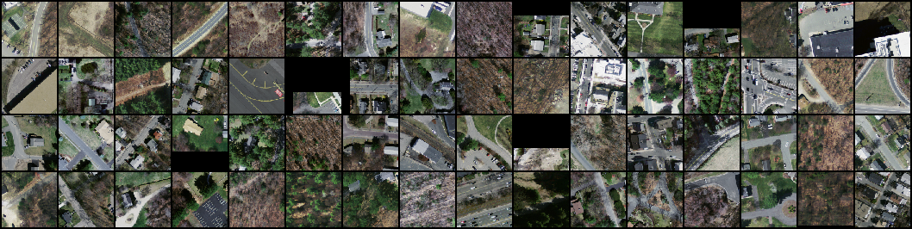

# Weakly-supervised road segmentation in high resolution remote sensing images using point annotations

  <b>Abstract: </b>
The road extraction methods based on semantic segmentation have achieved great success in recent years, but creating accurate pixel-wise labels is a boring and expensive task, especially for large-scale high-resolution remote sensing images (HRSI). Inspired by stacked hourglass model for human joints detection, this paper proposes a weakly-supervised road segmentation method based on point annotations. First, a patch-based road center point estimation network is designed and trained by point labels in advance. Then, in the process of segmentation, the network infers a series of road and background seeds for training a support vector classifier (SVC), which conversely classifies all the pixels into road and non-road classes. According to the local geometry shape of road and the inaccurate classification of SVC, a multi-scale & multi-direction Gabor filter (MMGK) is proposed to compute the road probability density estimation (RPDE). Due to the inhomogeneous intensity of RPDE, an Active Contour Model based on local binary fitting energy (LBF-Snake) is introduced to extract the road regions from RPDE. Qualitative and Quantitative comparisons show that our method achieves competitive results comparing to fully-supervised semantic methods in publicly available datasets.
  

# Dataset
We use <a href='http://www.cs.toronto.edu/~vmnih/data/'>Massachusetts Roads Dataset</a> and <a href='http://www.escience.cn/people/guangliangcheng/Datasets.html'>Google Earth</a> to evaluation the performance of our method. 

# Training Samples
The road point estimation model is trained by point annotations. To evaluate the model in application scenes, we implemented a road center point sample software , and employed 78 students to manually sample a dataset containing about 240,000 training samples. There are some of our training samples. where the ground truths are gaussians center at the road center points shown in cyan. Note that there are some samples without ground truth for no roads inside these patches.

# Some visual comparisons in training process
We set the train batch-size to 64. We display some visual comparisons between the prediction map and the groud truth, they are expressed in grid images
1. Training images

2. Ground truth

3. prediction visulization

# Some prediction results infered by our road center estimation model

Exhibition of more predicted samples, in which the predicted road center points are presented in bold red diamonds. Note that there are some samples without road center points due to none roads in those patches.

# Algorithm pipeline

1.	Search road seeds and background seeds using road center estimation network.
2.	Train an SVC model using the road and background seeds in Luv color space.
3.	Classify all the pixels into road and non-road using Luv color features.
4.	Road probability density estimated by MMGK.
5.	Based on the road probability map, obtain the optimal contours by iteratively minimizing the LBF energy function.
6.	Initial road segmentation according to the contours
7.	Refine road segmentation by simple post-process.

<table>
  <tr>
    <td></td>
    <td></td>
    <td></td>
    <td></td>
    <td></td>
    <td></td>
  </tr>
  <tr align='center'>
    <td>(a)</td>
    <td>(b)</td>
    <td>(c)</td>
    <td>(d)</td>
    <td>(e)</td>
    <td>(f)</td>
  </tr>
  <tr>
  <td colspan='6'>(a) Test image with road seeds and background seeds are shown in yellow dots and red dots respectively. (b) Pixel classification by SVC trained by the seeds, in which red and white represent road and nonroad class, respectively. (c) Road probability density estimated by Multi-scale & Multi-direction Gabor kernels. (d) Initial contours generated from seeds. (e) Road contours achieved by LBF-Snake according to road probability density. (f) Road segmentation by simple post-process.</td>
  </tr>
</table>

# Output Visualization
Exhibition of some road segmentation results on the Massachusetts Roads dataset.

